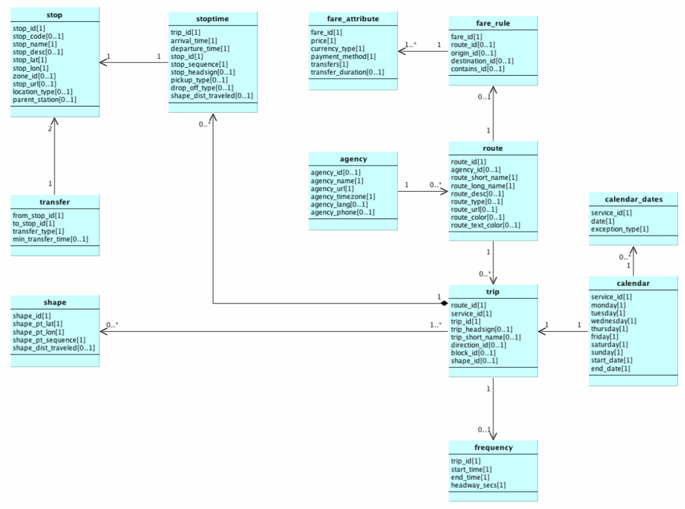
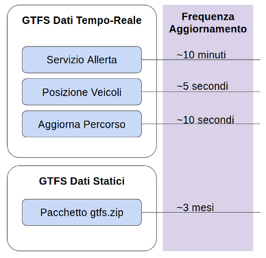

# General Transit Feed Specification (GTFS)
The General Transit Feed Specification (GTFS) is the standard format used by Google in the [Transit APIs](https://developers.google.com/transit/), that defines a common format for public transportation schedules and associated geographic information. GTFS "feeds" let public transit agencies publish their transit data and developers write applications that consume that data in an interoperable way. GTFS is intended to share static transport infrastructure data like bus stops or metro stations, routes, mobility agencies, etc. Exists a GTFS realtime extension that agencies can use to share dynamic data for trip update, service alerts and veichles position.
The Realtime GTFS "feeds" are based on [Protocol Buffers](https://github.com/google/protobuf)

## Static GTFS

* [Static GTFS official Google documentation](https://developers.google.com/transit/gtfs/)
* ER Diagram
  

## Realtime GTFS

* [Realtime GTFS official Google documentation](https://developers.google.com/transit/gtfs-realtime/)
* [Realtime GTFS reference](https://github.com/google/transit/blob/master/gtfs-realtime/spec/en/reference.md) (on GitHub)
* Typical Update Frequencies
  

## List of italian GTFS and other Transport API
  - Google Maps Transit (https://www.google.com/intl/it/landing/transit/)
  - List of GTFS in Italy https://www.google.com/landing/transit/cities/index.html

  - http://www.gtfs-data-exchange.com/agencies/bylocation

## GTFS Official Data Exchange
http://www.gtfs-data-exchange.com/

## GTFS Linked Open Vocabulary
http://lov.okfn.org/dataset/lov/vocabs/gtfs

## GTFS Based Visualization ond services
- The Netherlands Rail - [Realtime NL Trasport tracker](http://spoorkaart.mwnn.nl/)
- Swiss Travic - [Realtime Travic Trasport tracker](http://tracker.geops.ch/)

## GTFS Tools
* gtfs-csv2rdf
  Mapping library which transforms GTFS CSV files into GTFS triples using the [GTFS vocabulary](http://vocab.gtfs.org/). https://github.com/OpenTransport/gtfs-csv2rdf

## Books on GTFS
a list of books on GTFS
* [GTFS Book](http://gtfsbook.com/)